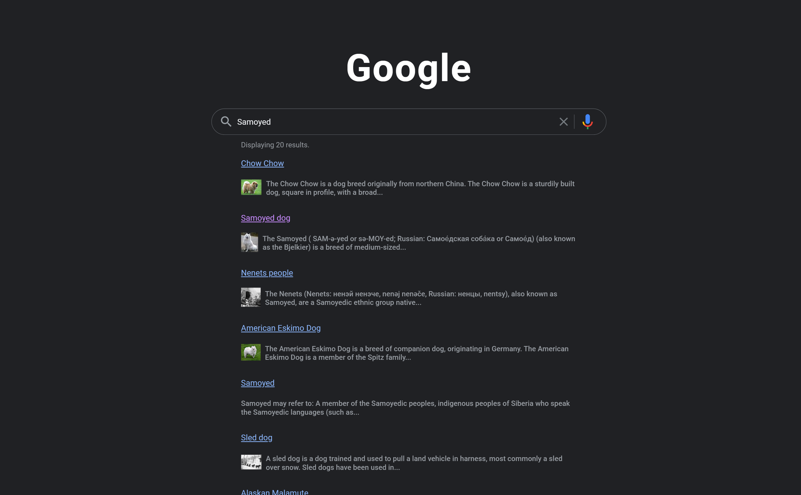
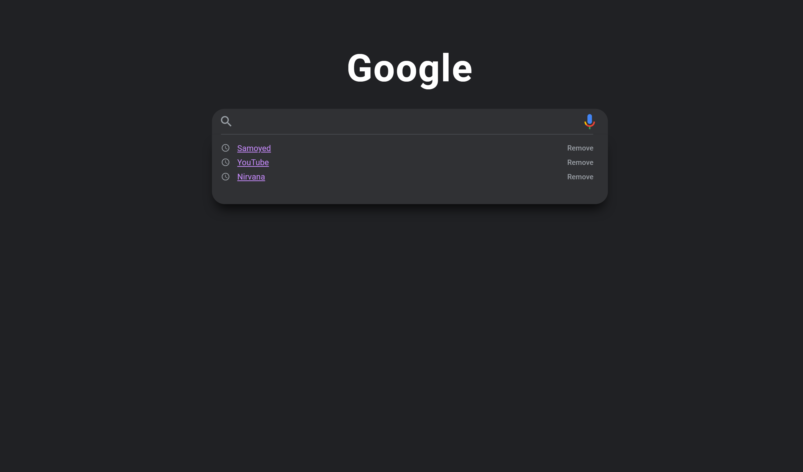

<h1 align="center">Search App</h1>

  <h3>
    <a href="https://{your-demo-link.your-domain}">
      Live Demo
    </a>
  </h3>

## Table of Contents

- [Overview](#overview)
  - [Built With](#built-with)
- [Features](#features)
- [Contact](#contact)

## Overview

Search app build with Wikipedia API for getting Data and Web Speech API for searching by voice. 
### ⚠ Warnings:  
<h6>Search by voice works only Google Chrome, Edge and Safari.</h6> 
<h6>If you are get CORS ERROR you can use [cors-anywhere](https://cors-anywhere.herokuapp.com/) to help with accessing data from other websites that are normally forbidden by the same-origin policy of web browsers or you can download extension [allow CORS](https://chrome.google.com/webstore/detail/allow-cors-access-control/lhobafahddgcelffkeicbaginigeejlf?utm_source=chrome-ntp-icon) and toggle "on" on extension tab.<h6>
<h6>For search by voice make sure allow use microphone option</h6>

### Built With

- HTML
- SASS
- JavaScript
- AJAX
- [Wikipedia API](https://www.mediawiki.org/wiki/API:Main_page)
- [Web Speech API](https://developer.mozilla.org/en-US/docs/Web/API/Web_Speech_API)
- [Google Fonts and Icons](https://fonts.google.com/icons)

## Features

User able do search by query or by voice and search by using recent tab list

## Contact

- GitHub [anarseferrov](https://{github.com/anarseferrov})
- Twitter [anarseferrov](https://{twitter.com/anarseferrov})
